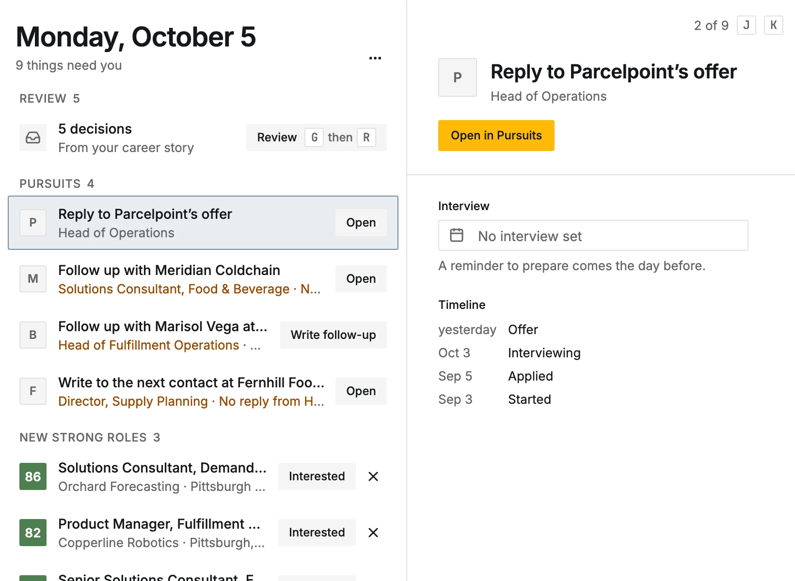
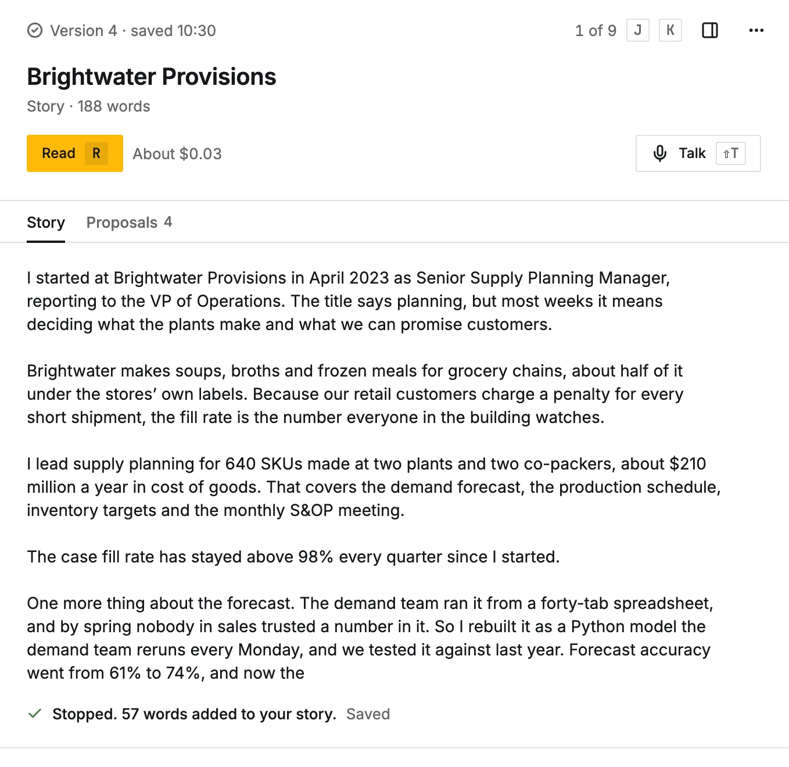
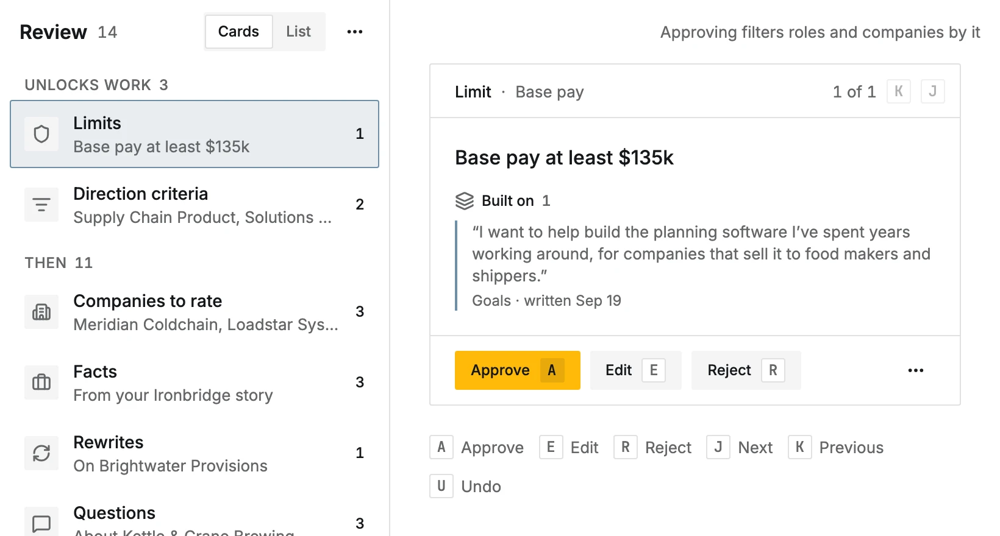
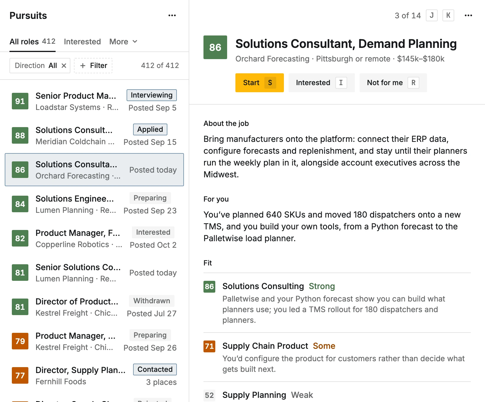
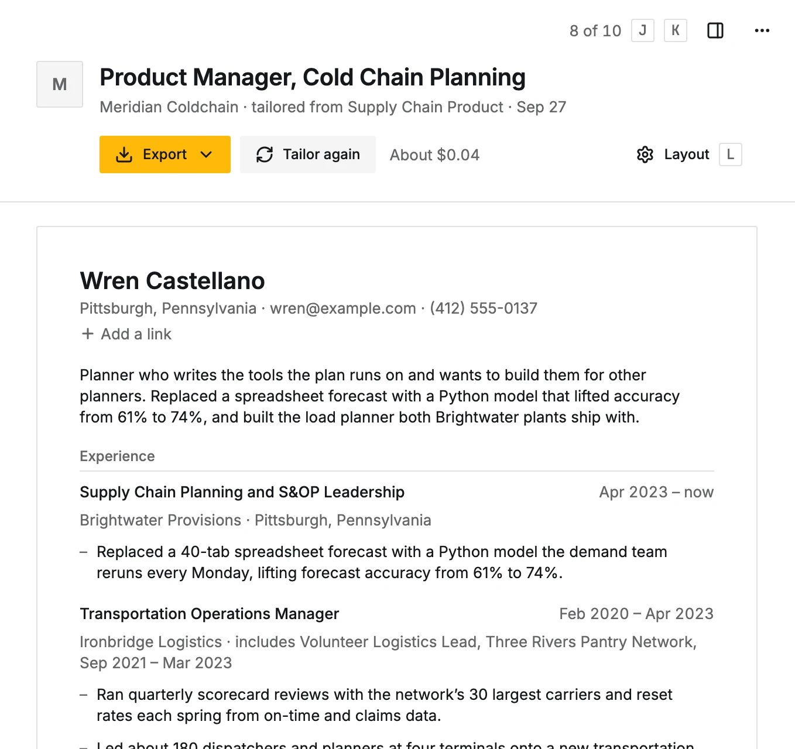

# CareerBot

**An open-source AI job search assistant. It learns your whole career, points you at the companies and roles where you'll stand out, and gets you ready to apply or to write straight to the people who hire.**

[](https://careerbot.dev/changelog) [](LICENSE)

You tell CareerBot your career in your own words, job by job and project by project. It turns that into a record of what you've done, which you review and approve. You say where you want to go next, or ask it where you could go. It finds companies worth wanting, watches their openings, and tells you which roles deserve your time and why. When you go after one, it writes a tailored resume, cover letter and outreach message from your record, and finds the people to talk to.

- **Every line it writes about you links back to something you said**, so you can speak to all of it in an interview.
- **Nothing enters your record or goes out under your name without your say-so.** CareerBot never sends anything: you apply and send every message yourself.
- **AI spending runs on budgets you set**, on your own keys.
- **It takes real time.** Telling the story of a job is often 20 minutes or more. What you get back is a record you can stand behind.

<p align="center">
  <picture>
    <source media="(prefers-color-scheme: dark)" srcset="public/docs-shots/today-dark.webp">
    
  </picture>
</p>

<p align="center">
  <a href="https://demo.careerbot.dev/demo"><b>Try the demo</b></a> ·
  <a href="https://careerbot.dev">careerbot.dev</a> ·
  <a href="https://careerbot.dev/docs">Docs</a> ·
  <a href="https://careerbot.dev/changelog">Changelog</a>
</p>

The [demo](https://careerbot.dev/docs/demo) is CareerBot itself with a made-up person's search already in it: her record, goals, ranked roles, resumes, a cover letter and outreach. No account, nothing to set up, and nothing you do there is saved.

## What it does

<table>
  <tr>
    <td width="50%" valign="top">
      <b>1. Tell your story.</b> One story per job or project, in your own words, typed or spoken. CareerBot reads it and proposes roles, facts and, later, insights across your career.
      <br><br>
      <picture>
        <source media="(prefers-color-scheme: dark)" srcset="public/docs-shots/story-talk-dark.webp">
        
      </picture>
    </td>
    <td width="50%" valign="top">
      <b>2. Approve your record.</b> Each proposal waits in Review, showing what it's built on, until you approve, edit or reject it. Only what you approve becomes your record.
      <br><br>
      <picture>
        <source media="(prefers-color-scheme: dark)" srcset="public/docs-shots/review-dark.webp">
        
      </picture>
    </td>
  </tr>
  <tr>
    <td width="50%" valign="top">
      <b>3. Aim at the right roles.</b> Your goals become directions and limits. CareerBot finds companies that fit for you to rate, reads their job boards every morning, and scores each role for each direction with a sentence on why.
      <br><br>
      <picture>
        <source media="(prefers-color-scheme: dark)" srcset="public/docs-shots/role-dark.webp">
        
      </picture>
    </td>
    <td width="50%" valign="top">
      <b>4. Apply, write to a person, or both.</b> A resume tailored to the posting, a cover letter and answers to its questions. Or the hiring manager, someone on the team or a recruiter, with a short message drafted from your record.
      <br><br>
      <picture>
        <source media="(prefers-color-scheme: dark)" srcset="public/docs-shots/resume-dark.webp">
        
      </picture>
    </td>
  </tr>
</table>

Then it keeps track: each pursuit's status, timeline and next step, with reminders and a drafted follow-up when things go quiet. [How it works](https://careerbot.dev/docs/how-it-works) has the whole picture.

## Two ways to use it

- **careerbot.dev**: the hosted version, invite-only while it's tested. [Get notified](https://careerbot.dev) when it opens.
- **Your own copy**: run it on your own computer or a server, for yourself or a few people you add. You bring your own OpenRouter key for the AI and a Convex backend for the data (self-hosted in the same Docker Compose setup, or Convex's free cloud plan).

## Quick start

You need Docker with Compose v2.20 or later, and Git. The images are prebuilt for amd64 and arm64 (`ghcr.io/careerbotdev/careerbot-web` and `ghcr.io/careerbotdev/careerbot-setup`), so nothing is built on your machine.

```bash
git clone https://github.com/careerbotdev/careerbot.git
cd careerbot
cp .env.example .env               # read it and fill it in
docker compose pull
docker compose up -d
docker compose logs convex-setup   # the setup code for your first account
```

Open `SITE_URL` (http://localhost:3000 by default) and create the owner account with the setup code. Then add your OpenRouter key and a monthly budget in Settings.

`compose.yaml` runs the release it came with. To choose another, set `CAREERBOT_VERSION` in `.env`: a version such as `0.8.0` stays on that release, and `latest` moves to each new release when you pull.

The full guide is [Run it with Docker](https://careerbot.dev/docs/self-hosting/docker). Other ways:

- [Coolify](https://careerbot.dev/docs/self-hosting/coolify) or [Dokploy](https://careerbot.dev/docs/self-hosting/dokploy) on a server, which give it a domain and HTTPS
- [A VPS with Coolify](https://careerbot.dev/docs/self-hosting/vps)
- [Your own computer](https://careerbot.dev/docs/self-hosting/your-computer), with Docker Desktop or OrbStack
- [Cloudflare Workers](https://careerbot.dev/docs/self-hosting/cloudflare), the way careerbot.dev runs, with Convex's cloud

## Updating

Back up first, and read the [changelog](https://careerbot.dev/changelog) (also [`CHANGELOG.md`](CHANGELOG.md)). When a release says **Read before updating**, do its steps. Then, in the folder you cloned:

```bash
git pull
docker compose pull
docker compose up -d
```

Your data stays. A self-hosted copy checks for new releases once a day and tells its owner in Settings, under Updates. Backups and updating on Coolify, Dokploy or Cloudflare: [Updates, backups, export](https://careerbot.dev/docs/self-hosting/updates). Self-hosted Convex is upgraded as a step of its own: [Upgrading self-hosted Convex](https://careerbot.dev/docs/self-hosting/convex#upgrading-self-hosted-convex).

## Costs and keys

CareerBot itself is free. What you pay for, you pay to each service directly:

| What | What it's for | Needed | Cost |
| --- | --- | --- | --- |
| [OpenRouter](https://openrouter.ai) key | Every AI task, on the models you choose | Yes | Pay as you go at OpenRouter, within the monthly AI budget you set in CareerBot |
| [Apollo](https://www.apollo.io) key | Finds companies, their details, job postings and the people to contact | No | Apollo's own plans and credits, within the credits you set aside each month |
| Brave Search key | Finds a company's job board when its website doesn't link one | No | Brave's own plans |
| [Convex](https://www.convex.dev) | The database, background work and sign-in | Yes | The free cloud plan, or nothing extra when self-hosted beside the app |
| Somewhere to run it | The app | Yes | Your own computer: nothing. A small VPS: a few euros or dollars a month |

No AI work runs until you set a monthly AI budget. Before each AI call, CareerBot sets aside the most that call could cost, and most buttons that start AI work show what it costs beside them. More: [Budgets and costs](https://careerbot.dev/docs/ai/budgets), [Keys and accounts](https://careerbot.dev/docs/self-hosting/keys).

## Privacy

- What you give CareerBot is used only for your own job search. It isn't sold, used for advertising, or shared with employers.
- To read, rank and write for you, it sends the needed parts of your stories, record, goals and job postings to the AI models you choose, through OpenRouter. Apollo and Brave get search terms only, never your stories or record.
- Keys are stored encrypted. Each person has a workspace of their own, and nothing in one is visible from another.
- On a copy you run yourself, everything stays in your own accounts and it sends no analytics. Its daily update check fetches [careerbot.dev/releases.json](https://careerbot.dev/releases.json) and sends no account, personal data or anything about the copy or its people, but like any web request it shows careerbot.dev your server's IP address; turn it off in Settings, under Updates, or with `UPDATE_CHECK=off` in `.env`.

The details: [Privacy and your data](https://careerbot.dev/docs/how-it-works/privacy).

## Tech stack

- [Next.js](https://nextjs.org) and React for the web app, styled with Tailwind CSS from the design tokens in [`DESIGN.md`](DESIGN.md)
- [Convex](https://www.convex.dev) for the database, live updates, background jobs, file storage and sign-in
- [OpenRouter](https://openrouter.ai) for every AI call, so models can be swapped without code changes
- Docker Compose for your own copy; Cloudflare Workers for careerbot.dev
- [Fumadocs](https://fumadocs.dev) for the docs in [`content/docs`](content/docs), Storybook for the parts every screen is built from, and a [LikeC4](https://likec4.dev) map of the whole system in [`docs/architecture`](docs/architecture)

## Docs

- [Using CareerBot](https://careerbot.dev/docs/start): from signing in to your first pursuit
- [How the AI works](https://careerbot.dev/docs/ai): every step in order, and what it reads
- [Run your own copy](https://careerbot.dev/docs/self-hosting): Docker, Coolify, Dokploy, a VPS or Cloudflare
- [Troubleshooting](https://careerbot.dev/docs/troubleshooting): what a message means, and what to do about it

Every copy carries the docs for its own version at `/docs`.

## Contributing

Bug fixes, features and better docs are welcome. Start with [`CONTRIBUTING.md`](CONTRIBUTING.md) and [Local development](https://careerbot.dev/docs/contributing): Node.js 22.18 or later, pnpm, then `pnpm dev` and `pnpm dev:convex`. To build the Docker images from your clone instead of pulling them:

```bash
docker compose -f compose.yaml -f compose.build.yaml up -d --build
```

## License

[GNU AGPL-3.0](LICENSE). You can use, change and share CareerBot. If you run a changed copy for other people, offer them its source code under the same license. See [License](https://careerbot.dev/docs/contributing/license).
